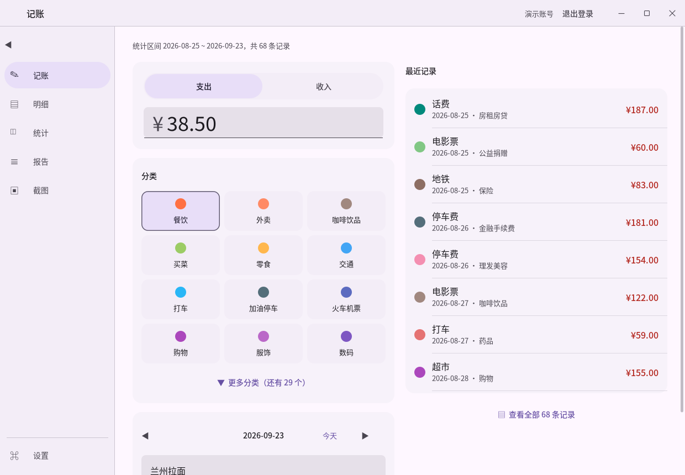
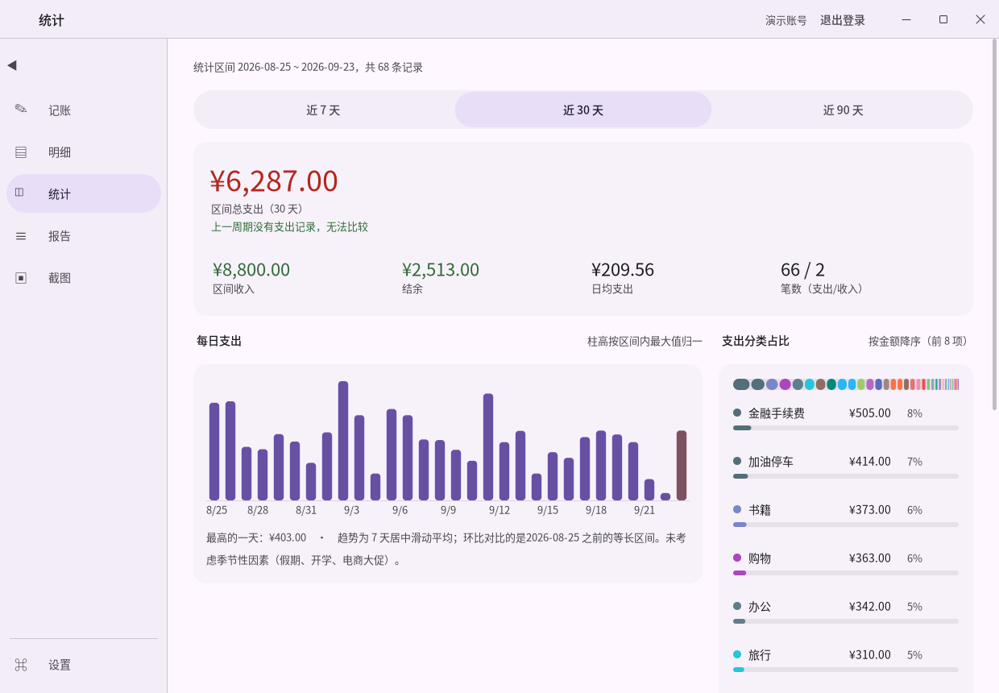

# PenHu Ledger

记每日花销的桌面软件。C++ 写的，单个 exe，数据全在自己电脑里，账本用密码加密。





## 它能干什么

- **记账**。金额、分类、备注、日期。预置了 52 个分类，也能自己加。
- **看数**。日均、环比、趋势曲线、分类占比，哪天花得离谱会标出来。
- **写总结**。让大模型把这段时间的花销写成人能读的一段话。没配模型也有模板版兜底，不会给你开天窗。
- **截图入账**。把微信、支付宝的支付截图扔进去，自动读出金额、商户、时间，你核对一下点确认就入库。一次能扔好几张。
- **多账号**。一台电脑几个人用，各自的账本分开加密，互相看不到。

不联网也能记账、看统计。联网只干两件事：调大模型写报告、下载本地模型的引擎。界面是纯 Win32 自己画的，不带浏览器内核，亮暗两套主题，窗口拉宽了自动变多栏。

（老版本的界面是 WebView 套网页，2026 年 9 月整个换成了原生自绘。翻到旧记录里看到什么 `web/` 目录、`penhu-ledger.exe`，说的是换掉之前那套。）

## 怎么构建

我这台机器上的组合：MSVC + CMake + Ninja + vcpkg，静态链接，最后出来一个不依赖运行库的 exe。

```bash
# 1. 装依赖（最慢的一步，OpenSSL 和 SQLCipher 要从源码编）
bash _vcpkg.sh install --triplet x64-windows-static

# 2. 完整构建，产物在 build/bin/ 下
bash _build_full.sh

# 3. 只编纯逻辑那部分跑跑测试（零第三方依赖，几十秒的事）
bash _build_portable.sh && ./build-portable/bin/penhu-tests-portable.exe
```

**不用改路径**：脚本会自己找到项目目录。vcpkg 和 ninja 默认放在项目文件夹的上一级（`vcpkg/`、`tools/`），放别处就用环境变量 `VCPKG_WIN` / `NINJA_WIN` 指过去。唯一可能要动的是脚本里写的 Windows SDK 版本号（`10.0.26100.0`）。另外脚本里的注释都是踩坑记录——什么环境变量被吞了、什么工具找不到，动之前先读一遍，能省你半天。

Linux 也能编（Wayland + Cairo 那套，打包脚本在 `packaging/`）：

```bash
bash _build_linux.sh native
```

## 代码怎么分的

```
core/      全部业务逻辑，不碰界面
native/    界面（Windows 自绘，Linux 走 Wayland）
server/    本机 JSON 接口，只听 127.0.0.1
cli/       命令行自检工具
tests/     测试
```

一条规矩贯穿到底：界面、命令行、HTTP 接口，想干业务操作只准找 `core` 里的 `LedgerService` 这一个门面，不许绕过它直接碰数据库和加密。像"改密码"这种必须一口气干好几件事的操作（备份、重加密账本、踢掉旧会话），实现只有一份，不会哪个入口漏掉一步。

core 里面还切了一刀：金额、日期、统计这些纯逻辑单独打包，不带任何第三方库。改统计口径的时候几秒钟编完跑一遍测试，不用等 SQLCipher 那一大堆。开发的时候好几个"算错钱"的 bug 就是这么几分钟内抓出来的，不然它们会一直躺到你对账那天。

顺带说一句，钱在代码里是用整数"分"存的，不是浮点。0.1 加 0.2 不等于 0.3，用浮点记账，日汇总会悄悄漂几分钱。

## 你的密码和数据

```
数据目录（默认在 用户目录\PenHuLedger）
  users.db            明文，只有用户名和密码哈希
  data/<uuid>.db      每人一个账本，整库 AES-256 加密
  backups/            改密码、删账号前自动备份
  logs/               日志
```

密码过一遍 Argon2id 派生出账本密钥，密钥只存在内存里，不落盘。所以每次重启程序都得重新登录，这是故意的。谁把你的硬盘拆走，能看到的只有"这台机器上有哪几个账号"，记了什么、多少钱，拿不到。密码哈希也故意做得很慢，别人捡到账本想暴力猜密码，每一猜都得等。

云服务的 API Key 同样加密存，还绑了账号——挪到别的账号下面解不开。

**挡不住的，说在前面**：能读你进程内存的攻击者（密钥就在内存里）、键盘记录器、截屏木马。这些对本机软件没有好办法，谁跟你说有都是骗人的。用户名是明文存的，不然登录页没法列出账号让你选，这是取舍。

## 大模型那两块的底线

报告和识图都走同一条降级链：云端模型 → 本地模型（llama.cpp）→ 规则模板。全挂了也有产出，页面上会写清楚用的是哪条通道、其他通道为什么不行。

有两件事是刻意这么做的：

**模型写的字和数字分开。** 页面上所有金额、笔数、百分比都来自咱们自己算的结构化数据，模型的话只当叙述看。小模型抄错数字是常事，把它嘴里的数字当真会误导人。

**识图只出草稿。** 模型读完截图，金额和分类你都能改，点"确认入账"才真进账本。看不清就报"未识别"，绝不拿别的数字顶上——一个猜错的金额悄悄混进账本，比让你手填糟糕得多。往目录里批量丢图自动入账也行，但"识别完直接记账"和"入账后删原图"这两个开关默认都是关的，因为它们会把模型出错的代价放大，该不该开你说了算。

## 怎么知道它真的能用

"我觉得没问题"不算数，下面这些都能原样复跑：

| 验证什么 | 怎么跑 | 我这边的结果 |
|---|---|---|
| 纯逻辑（金额、日期、统计） | `bash _build_portable.sh` | 50 个用例 / 1852 条断言全过 |
| 完整（加密、多账号隔离、端到端） | `bash _build_full.sh` 后跑 `build/bin/penhu-tests.exe` | 75 个用例 / 4226 条断言全过 |
| 命令行自检 | `penhu-cli.exe selftest` | 33 项全过 |
| HTTP 接口端到端 | `bash _e2e_api.sh` | 24 项全过 |
| 界面交互（自动的） | `penhu-native.exe --diag-login <账号> --diag-pass <密码> --diag-shot out.png` | 20 多项断言 |
| 界面排版 | `penhu-native.exe --shot <目录>`，和 `_shots_records/` 里的基准图逐像素比 | 六个页面 + 深色主题 |

最后两项值得多说两句。`--diag-*` 那个是无人值守的界面测试：开真窗口、自动登录，然后往里发真的鼠标键盘消息——点分类、粘贴、滚动、切页、最大化再还原——每一步都断言。以前那些"点一下就闪退""滚不动""还原后窗口跑偏"的 bug，全是这么抓出来的。跑完窗口链会把一张测试图送进回收站，重跑前把 `_scan_test` 里的 3 张 PNG + 1 个 txt 补齐，账号也得换新的。

`--shot` 是把界面渲染成图片，专门用来核对排版的。有些问题不报错、不崩溃，就是难看或者字被切了，只有看图才发现。

## 已知的坑

- 构建脚本写死了我这台机器的路径，换机器必须改。
- 触摸屏那套适配（48dp 命中区之类）是照规范写的，我这台笔记本没触摸屏，真实手感没验过。
- 诊断链有个去重断言在"首扫刚好 1 张"的场景有边界问题，还没修（`docs/FLICKER_FIX.md` 里记着）。
- `docs/` 里几篇文档记着修闪退、修黑屏、修线程问题的过程，写得比较细，遇到类似问题可以翻。

想看分层、界面框架、各种取舍的细节，看 [ARCHITECTURE.md](ARCHITECTURE.md)。